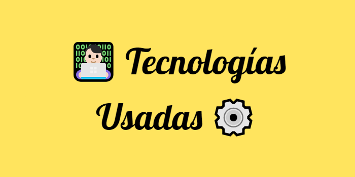
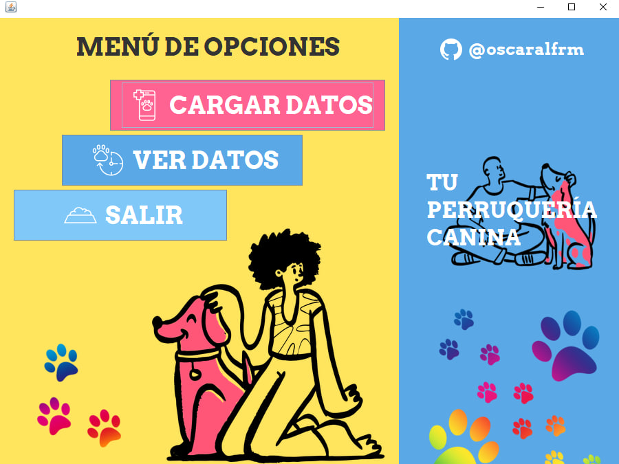
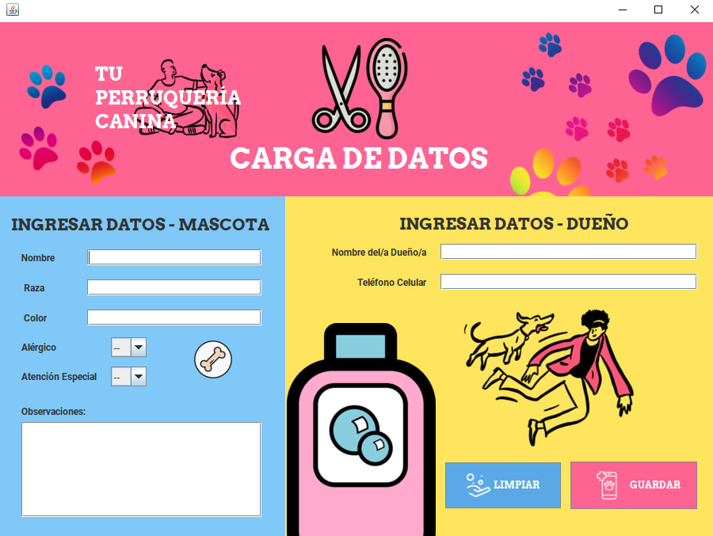
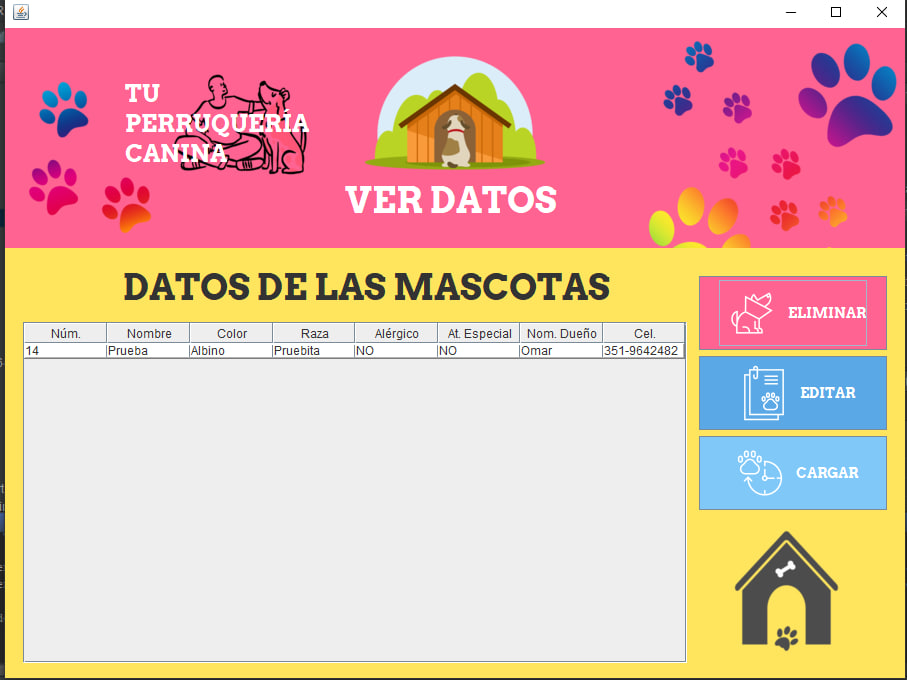
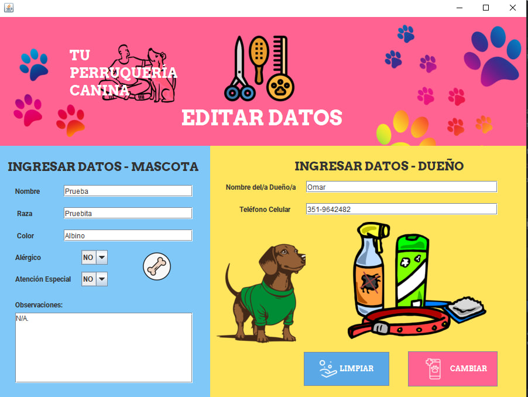

<section align="center">
  

<section align="justify">

La siguiente aplicación fue elaborada como uno de los proyectos integradores del curso "Programación Orientada a Objetos con Java" de la Academia TodoCode: https://todocodeacademy.com/course/programacion-orientada-a-objetos-con-java/

En el mismo, se desarrolló el siguiente contenido.

- <strong>CRUD (Altas-Bajas-Modificación-Consulta)</strong> realizado con Java en el contexto de los requerimientos captados para un software pertinente a una Peluquería Canina.
- <strong>Modelo de 3 capas (Interfaz Gráfica de Usuario o GUI, Lógica y Persistencia)</strong>. Separación y delegación de responsabilidades para cada una de las capas funcionales, desde la toma y captación
de datos ingresados por el usuario del Sistema de Información hasta su posterior almacenamiento.
- <strong>Bases de Datos Relacionales</strong>: Con el Sistema Gestor de Bases de Datos MySQL.
- <strong>JPA</strong>: Java Persistence API, para el mappeo de las Entidades (Clases) que componen a nuestra aplicación. Se utilizó el proveedor EclipseLink (en futuros proyectos
se empleará el proveedor Hibernate).
</section>

  

  

Dentro de las tecnologías implementadas en el marco del proyecto, se usaron:

  

En el dominio sugerido (una peluquería canina), se realizó un ABMC/CRUD de las entidades "Mascota" y "Dueño" y se trabajó mediante una relación OneToOne para simplificar la interacción
entre dichas clases y la captación de datos a través de la interfaz creada con Java Swing.

Se hizo hincapié en el uso de un ORM como es el caso de JPA, usando el proveedor EclipseLink, para facilitar el mappeo de clases y permitir una relación más sólida entre las mismas. 
Además de utilizar en el SGBD de elección (MySQL) algunos comandos empleando SQL, el objetivo de utilizar un ORM es facilitar la manipulación e interacción de objetos creados desde 
la lógica y permitir su persistencia a lo largo del tiempo.

  

  

</section>
